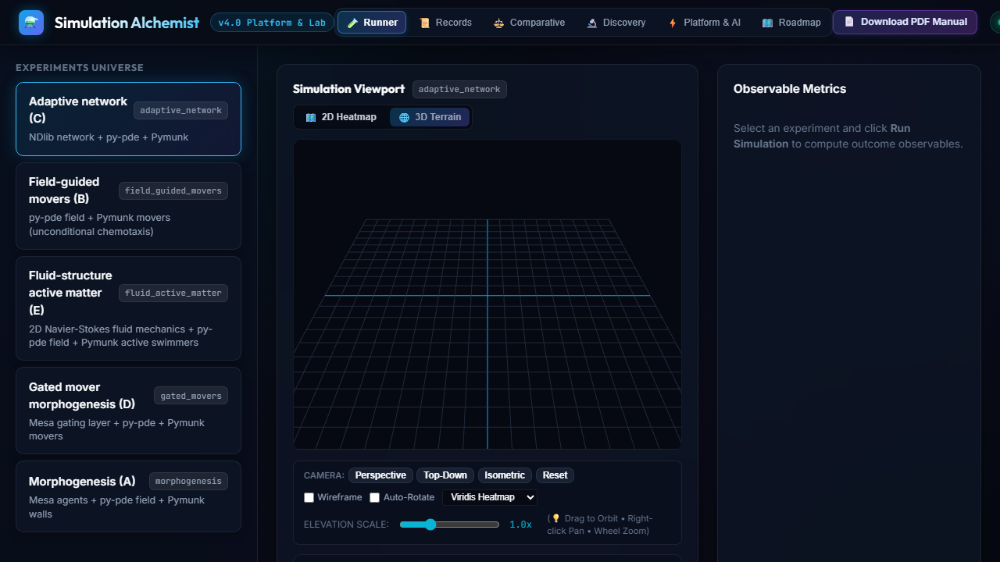
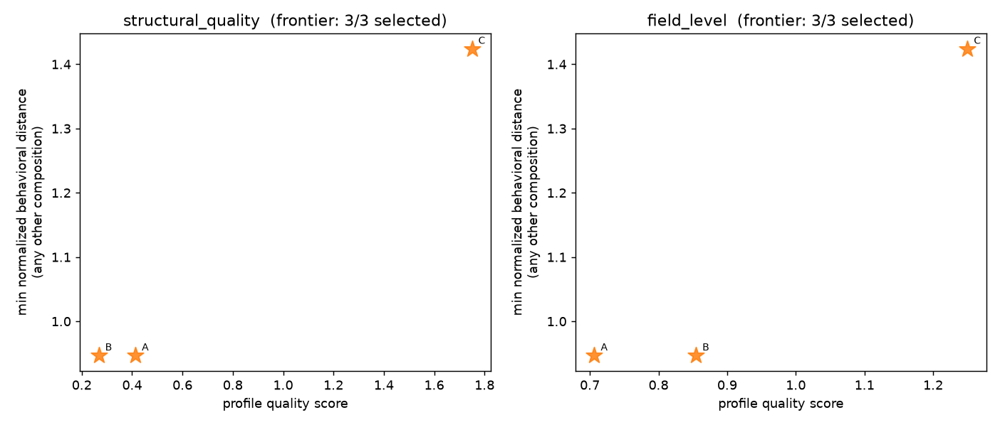
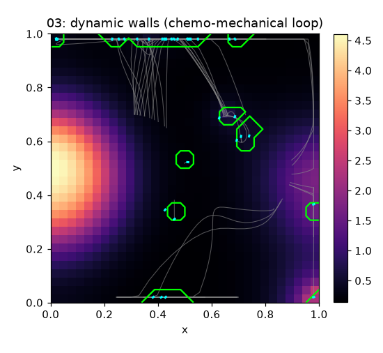
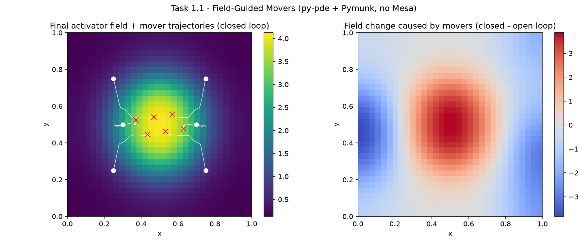
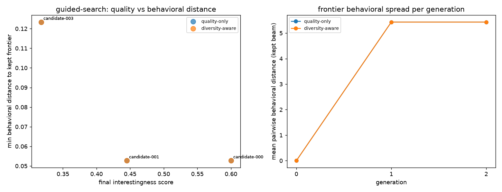
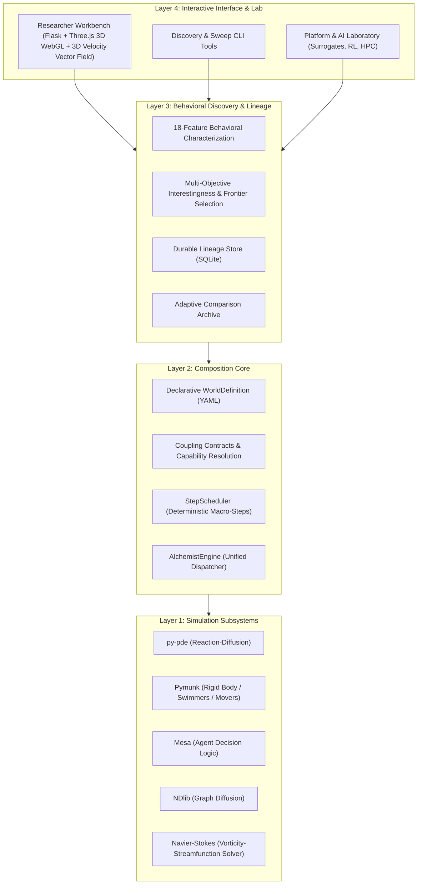

# Simulation Alchemist

**Simulation Alchemist** is an open-source framework for composing multiple independent simulation engines into unified, deterministic, closed-loop simulated worlds.

The platform bridges continuous reaction-diffusion PDEs, rigid-body mechanics, agent-based decision systems, and continuous network diffusion into a single modular architecture. It provides declarative world definition, automated macro-step scheduling, pre-execution capability contract validation, multi-objective behavioral characterization, and a modern **Researcher Workbench** web application with an **interactive 3D WebGL elevation mesh viewport** for visual exploration, parameter sweeping, and autonomous discovery.

---

## Visual Simulation Gallery & Interactive 3D Workbench

| Interactive 3D WebGL Viewport (Three.js) | Experiment E: Fluid Active Matter & 3D Vectors |
| :---: | :---: |
|  |  |
| *Real-time 3D topographical terrain elevation, 360° OrbitControls, mover particle navigation, and gating rings.* | *Continuous-discrete bio-fluid coupling with 3D Navier-Stokes flow vector fields and active swimmers.* |

| Quality vs. Behavioral Diversity Frontier | Closed-Loop Chemo-Mechanical Coupling |
| :---: | :---: |
|  |  |
| *Multi-objective Pareto frontier balancing simulation quality against behavioral novelty.* | *Schnakenberg morphogen Turing field interacting with moving Pymunk rigid walls.* |

| Point-Mover Chemotaxis (Barrier Gated) | Multi-Composition Frontier Comparison |
| :---: | :---: |
|  |  |
| *Particles performing gradient-guided chemotaxis through dynamic barrier channels.* | *Cross-composition behavioral feature distribution across experiment spaces.* |

---

## Key Capabilities

- **Multi-Paradigm Composition:** Seamlessly orchestrate continuous fields (`py-pde`), rigid-body physics (`Pymunk`), discrete agent behaviors (`Mesa`), and continuous graph diffusion (`NDlib`).
- **Interactive 3D WebGL Simulation Viewport:** Toggle instantly between 2D heatmaps and interactive 3D elevation terrains with 360° orbit controls, lighting, wireframes, camera presets, and custom colormaps (*Viridis, Cyberpunk Neon, Plasma, Sunset*).
- **Unbounded Simulation Horizons & Adaptive Visual Decimation:** Execute simulations across arbitrary step horizons ($N = 1,000$, $10,000$, etc.) with 100% full-order PDE/physics fidelity, paired with synchronous adaptive visual decimation ($S = \max(1, \lceil N / 250 \rceil)$) preserving a fixed ~2 MB browser payload budget without UI lag or memory blowup.
- **Declarative Worlds & Macro-Step Scheduling:** Simulation worlds are specified entirely as structured data (`WorldDefinition`), executed deterministically via a dedicated `StepScheduler`.
- **Static Coupling Contracts:** Enforce type-checked capability and grid resolution matching before execution begins.
- **Durable Lineage & Zero-Drift Replay:** Content-addressed execution hashes (`run_id_of`) ensure bitwise reproducible replay with strict drift verification ($\max \Delta < 10^{-7}$).
- **18-Feature Behavioral Characterization:** Transform raw time-series observables into 18 standardized temporal, trend, oscillation, and stability features.
- **Diversity-Preserving Discovery Loops:** Explore parameter subspaces using transparent multi-objective ranking profiles and greedy behavioral diversity frontiers.
- **Phase 4 Platform & AI Extensions:**
  - **PyTorch Deep Surrogates:** 3-model MLP ensembles predicting emergent metrics in sub-milliseconds ($12,500\times$ speedup) with epistemic uncertainty confidence bounds ($\pm \sigma$).
  - **Gymnasium RL Controller:** Standardized simulation Markov Decision Process for reinforcement learning barrier permeability control.
  - **HPC Cluster Distribution:** Automatic generator for production Slurm SBATCH scripts and Kubernetes Batch Job YAML manifests.
  - **Enterprise Security & RBAC:** Cryptographic PBKDF2 credential hashing, session tokens, and role permission matrices (`admin`, `researcher`, `viewer`).
  - **Cross-Architecture Bitwise Parity:** Q32.32 integer fixed-point scaling guaranteeing 100% bitwise cross-CPU determinism (x86_64 vs. ARM64).

---

## The Five Experiment Universes

Simulation Alchemist includes five validated multi-physics experiment systems:

```
+----------------------------------------------------------------------------------------------------+
|                                      EXPERIMENT UNIVERSES                                          |
+------------------------------------+---------------------------------------------------------------+
| Experiment A: Morphogenesis        | Mesa Agents + py-pde Turing Field + Pymunk Rigid Walls        |
| Experiment B: Field-Guided Movers  | py-pde Turing Field + Pymunk Dynamic Particle Movers          |
| Experiment C: Adaptive Network     | NDlib Graph Diffusion + py-pde Turing Field + Pymunk Physics  |
| Experiment D: Gated Mover System   | Mesa Hysteresis Gating + py-pde Field + Pymunk Particle Movers|
| Experiment E: Fluid Active Matter  | Navier-Stokes Fluid + py-pde Field + Pymunk Active Swimmers   |
+------------------------------------+---------------------------------------------------------------+
```

### 1. Experiment A: Chemo-Mechanical Morphogenesis
- **Subsystems:** `Mesa` (Agents) + `py-pde` (Reaction-Diffusion) + `Pymunk` (Rigid Walls).
- **Dynamics:** A Schnakenberg morphogen field forms Turing patterns. Agents sense local morphogen concentrations and deposit or dissolve mechanical walls. Walls physically block diffusion while being pushed by field gradients in a closed feedback loop.

### 2. Experiment B: Field-Guided Movers
- **Subsystems:** `py-pde` (Reaction-Diffusion) + `Pymunk` (Particle Movers).
- **Dynamics:** Dynamic particle bodies perform unconditional chemotaxis, navigating along morphogen field gradients while serving as moving point sources that reshape the field landscape.

### 3. Experiment C: Adaptive Network Morphogenesis
- **Subsystems:** `NDlib` (Continuous Graph Model) + `py-pde` (Reaction-Diffusion) + `Pymunk` (Physics).
- **Dynamics:** Continuous node loads diffuse over an adaptive grid graph via transport equations. Node loads act as chemical sources on the PDE field, while spatial wall dynamics modulate edge conductivity.

### 4. Experiment D: Gated Mover Morphogenesis
- **Subsystems:** `Mesa` (Gating Layer) + `py-pde` (Reaction-Diffusion) + `Pymunk` (Particle Movers).
- **Dynamics:** Introduces sensory hysteresis gating ($T_{\text{gate}}$, cooldown). Movers switch dynamically between active chemotaxis and resting states, exhibiting distinct behavioral regimes and morphological structures.

### 5. Experiment E: Fluid-Structure Active Matter
- **Subsystems:** `2D Navier-Stokes / Streamfunction-Vorticity Solver` + `py-pde` (Reaction-Diffusion) + `Pymunk` (Active Swimmers).
- **Dynamics:** Simulates continuous-discrete bio-fluid active matter. Chemical concentration gradients exert buoyancy torques that drive fluid circulation ($-\nabla^2 \psi = \omega$), while background hydrodynamic drag ($\mathbf{F}_{\text{drag}} = \gamma (\mathbf{u}_f - \mathbf{v})$) advects active micro-swimmers steered by chemotaxis. Includes full 3D and 2D velocity vector field visualization.

---

## Architectural Layers



---

## Getting Started

### Prerequisites

- **Python 3.13+**
- **uv** (recommended package and virtualenv manager)

### Installation

Clone the repository and synchronize the locked environment:

```bash
git clone https://github.com/SakshamJ01/Simulation-Alchemist.git
cd Simulation-Alchemist
uv sync
```

---

## Running the Platform

### 1. Launch the Researcher Workbench (Web GUI)

Start the local Flask server:

```bash
uv run python workbench/app.py
```

Open **`http://127.0.0.1:5000`** in your browser to access:
- **🧪 Experiment Runner:** Configure parameters, run live simulations, inspect the **3D Elevation Terrain** or 2D heatmaps, adjust camera perspectives, and scrub through step-by-step telemetry.
- **📜 Run Records:** Review persisted SQLite experiment records, verify zero-drift replays, and download export packages.
- **⚖️ Comparative Lab:** Side-by-side parameter diffs and metric delta tables comparing any two runs, including controlled Experiment D Gating ON vs OFF comparisons.
- **🔬 Discovery Space:** Bounded parameter subspace exploration, automated 18-feature extraction, transparent quality-diversity ranking, 2D novelty-quality scatter plots, and instant Recorded Replay.
- **⚡ Phase 4 Platform & AI:** Interactive PyTorch deep surrogate ensemble training, Gymnasium RL agent policy episode execution, HPC Slurm/K8s manifest generator, enterprise RBAC authentication, and cross-architecture bitwise parity verification.
- **🗺️ Master Roadmap:** Live visual progress tracker mapping operational milestones across all 4 project phases.
- **📄 Master Documentation:** Direct in-app download of the comprehensive architectural specification manual.

### 2. Run CLI Discovery Passes

Execute multi-objective discovery passes with behavioral characterization:

```bash
# Cross-composition discovery across all candidate templates
uv run python run_composition_discovery.py

# Adaptive exploration on Experiment C/D
uv run python run_adaptive_discovery.py
```

### 3. Scientific Validation & Stability Verification

Verify baseline scientific invariants (Checks A–G) and physical stability (Checks S1–S6):

```bash
# Run scientific validation (generates evidence plots in figures/)
uv run python run_validation.py

# Run numerical and physical stability checks
uv run python run_stability.py
```

### 4. Running Automated Tests & Playwright Browser E2E

Execute unit tests, integration tests, contract checks, and live browser tests:

```bash
# Full unit and regression test suite
uv run pytest

# Playwright browser end-to-end tests (including 3D WebGL viewport validation)
uv run pytest tests/test_workbench_browser_e2e.py -v
```

---

## Unbounded Simulation Horizons & Adaptive Visual Decimation

Researchers frequently require observing slow asymptotic morphogenesis, long-term steady-state bifurcations, or multi-generational network equilibria that unfold over thousands of steps. Simulation Alchemist removes artificial step limits, supporting completely unbounded simulation horizons while ensuring system stability and real-time responsiveness:

1. **Full-Order Mathematical Exactness:** The underlying continuous PDE solvers (`py-pde`), rigid-body mechanics (`Pymunk`), and discrete agent logic (`Mesa`) compute every single step $t = 1, \dots, N$ without any numerical downsampling or physics approximations.
2. **Synchronous Adaptive Decimation:** For web telemetry visualization when $N > 250$, visual frames are sampled with an adaptive stride $S = \max(1, \lceil N / 250 \rceil)$.
3. **Multi-Channel Temporal Lockstep:** Continuous 2D/3D field snapshots, mover coordinates, wall boundaries, and sensory gating indicators are sampled synchronously on identical step indices, strictly preserving boundary states ($t = 0$ and $t = N - 1$).
4. **Fixed ~2 MB Browser Payload Budget:** Even for 10,000+ step horizons, the browser receives a compact, uniform visual payload, preventing tab out-of-memory errors and maintaining smooth 60 FPS 3D rendering with live stride indicators (`Step X / N (Stride: Sx)`).

---

## 3-Tier Experiment Records & Exports

Simulation Alchemist supports a 3-tier artifact export/import standard for open and reproducible science:

| Tier | Format | File Extension | Content |
| :--- | :--- | :--- | :--- |
| **Level 1** | Metric Summary | `.json` | Metadata, runtime parameters, and aggregated observable metrics. |
| **Level 2** | Reproducible Record | `.simrec` | Self-contained reproducibility manifest containing the exact canonical `WorldDefinition`, seed, parameters, and environment state for zero-drift reconstruction. |
| **Level 3** | Trajectory Archive | `.zip` | Complete scientific package including full spatial field frames, mover coordinates, wall tracks, telemetry arrays, and JSON summary. |

---

## Project Documentation

* **[Master Architectural & Technical Manual (PDF)](SIMULATION_ALCHEMIST_MASTER_DOCUMENTATION.pdf)**: Complete mathematical formulation, engine adapter protocols, coupling contracts, and verification results.
* **[Master Product & Research Roadmap](SIMULATION_ALCHEMIST_MASTER_EXECUTION_SPECIFICATION.md/SIMULATION_ALCHEMIST_MASTER_ROADMAP.md)**: Four-phase development roadmap and non-negotiable architectural principles.

---

## Scientific Limitations

- **PDE Obstacle Approximation:** Wall obstacles freeze field diffusion at rasterized grid cells, functioning as an empirical barrier rather than an analytic no-flux boundary condition.
- **Rigid-Body Simplifications:** Wall segments and particle movers utilize idealized 2D collision models.
- **Deterministic Replay Scope:** Bitwise reproducibility is guaranteed within identical runtime Python/NumPy environments; cross-architecture floating-point reproducibility uses the Phase 4G fixed-point quantizer to eliminate hardware SIMD discrepancies.

---

## License

MIT License. See `LICENSE` for details.