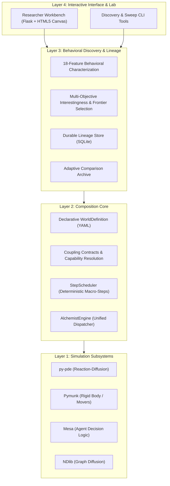

# Simulation Alchemist

**Simulation Alchemist** is an open-source framework for composing multiple independent simulation engines into unified, deterministic, closed-loop simulated worlds.

The platform bridges continuous reaction-diffusion PDEs, rigid-body mechanics, agent-based decision systems, and continuous network diffusion into a single modular architecture. It provides declarative world definition, automated macro-step scheduling, pre-execution capability contract validation, multi-objective behavioral characterization, and a modern **Researcher Workbench** web application for interactive experimentation and research automation.

---

## Key Capabilities

- **Multi-Paradigm Composition:** Seamlessly orchestrate continuous fields (`py-pde`), rigid-body physics (`Pymunk`), discrete agent behaviors (`Mesa`), and continuous graph diffusion (`NDlib`).
- **Declarative Worlds & Macro-Step Scheduling:** Simulation worlds are specified entirely as structured data (`WorldDefinition`), executed deterministically via a dedicated `StepScheduler`.
- **Static Coupling Contracts:** Enforce type-checked capability and grid resolution matching before execution begins.
- **Durable Lineage & Zero-Drift Replay:** Content-addressed execution hashes (`run_id_of`) ensure bitwise reproducible replay with strict drift verification ($\max \Delta < 10^{-7}$).
- **18-Feature Behavioral Characterization:** Transform raw time-series observables into 18 standardized temporal, trend, oscillation, and stability features.
- **Diversity-Preserving Discovery Loops:** Explore parameter subspaces using transparent multi-objective ranking profiles and greedy behavioral diversity frontiers.
- **Interactive Researcher Workbench:** Full-featured browser interface with real-time 2D spatial viewports, time scrubbers, comparative analysis, and automated discovery workspaces.

---

## The Four Experiment Universes

Simulation Alchemist includes four validated multi-physics experiment systems:

```
+----------------------------------------------------------------------------------------------------+
|                                      EXPERIMENT UNIVERSES                                          |
+------------------------------------+---------------------------------------------------------------+
| Experiment A: Morphogenesis        | Mesa Agents + py-pde Turing Field + Pymunk Rigid Walls        |
| Experiment B: Field-Guided Movers  | py-pde Turing Field + Pymunk Dynamic Particle Movers          |
| Experiment C: Adaptive Network     | NDlib Graph Diffusion + py-pde Turing Field + Pymunk Physics  |
| Experiment D: Gated Mover System   | Mesa Hysteresis Gating + py-pde Field + Pymunk Particle Movers|
+------------------------------------+---------------------------------------------------------------+
```

### 1. Experiment A: Chemo-Mechanical Morphogenesis
- **Subsystems:** `Mesa` (Agents) + `py-pde` (Reaction-Diffusion) + `Pymunk` (Rigid Walls).
- **Dynamics:** A Schnakenberg morphogen field forms Turing patterns. Agents sense local morphogen concentrations and deposit or dissolve mechanical walls. Walls physically block diffusion while being pushed by field gradients in a closed feedback loop.

### 2. Experiment B: Field-Guided Movers
- **Subsystems:** `py-pde` (Reaction-Diffusion) + `Pymunk` (Particle Movers).
- **Dynamics:** Dynamic particle bodies perform unconditional chemotaxis, navigating along morphogen field gradients while serving as moving point sources that reshape the field landscape.

### 3. Experiment C: Adaptive Network Morphogenesis
- **Subsystems:** `NDlib` (Continuous Graph Model) + `py-pde` (Reaction-Diffusion) + `Pymunk` (Physics).
- **Dynamics:** Continuous node loads diffuse over an adaptive grid graph via transport equations. Node loads act as chemical sources on the PDE field, while spatial wall dynamics modulate edge conductivity.

### 4. Experiment D: Gated Mover Morphogenesis
- **Subsystems:** `Mesa` (Gating Layer) + `py-pde` (Reaction-Diffusion) + `Pymunk` (Particle Movers).
- **Dynamics:** Introduces sensory hysteresis gating ($T_{\text{gate}}$, cooldown). Movers switch dynamically between active chemotaxis and resting states, exhibiting distinct behavioral regimes and morphological structures.

---

## Architectural Layers



---

## Getting Started

### Prerequisites

- **Python 3.13+**
- **uv** (recommended package and virtualenv manager)

### Installation

Clone the repository and synchronize the locked environment:

```bash
git clone https://github.com/SakshamJ01/Simulation-Alchemist.git
cd Simulation-Alchemist
uv sync
```

---

## Running the Platform

### 1. Launch the Researcher Workbench (Web GUI)

Start the local Flask development server:

```bash
uv run python workbench/app.py
```

Open **`http://127.0.0.1:5000`** in your browser to access:
- **Experiment Runner:** Configure parameters, run live simulations, inspect 2D spatial viewports (Viridis field heatmaps, particle trails, gating indicators), and scrub through time steps.
- **Run History & Records:** Review persisted SQLite experiment records, verify zero-drift replays, and download export packages.
- **Comparative Analysis:** Side-by-side parameter diffs and metric delta tables comparing any two runs, including controlled Experiment D Gating ON vs OFF comparisons.
- **Discovery & Automation:** Bounded parameter subspace exploration, automated 18-feature extraction, transparent quality-diversity ranking, 2D novelty-quality scatter plots, and instant Recorded Replay.

### 2. Run CLI Discovery Passes

Execute a multi-objective discovery pass with behavioral characterization:

```bash
# Cross-composition discovery across all candidate templates
uv run python run_composition_discovery.py

# Adaptive exploration on Experiment C/D
uv run python run_adaptive_discovery.py
```

### 3. Scientific Validation & Stability Verification

Verify baseline scientific invariants (Checks A–G) and physical stability (Checks S1–S6):

```bash
# Run scientific validation (generates evidence plots in figures/)
uv run python run_validation.py

# Run numerical and physical stability checks
uv run python run_stability.py
```

### 4. Running the Test Suite

Execute the comprehensive automated test suite (unit tests, integration tests, contract checks, and API tests):

```bash
uv run pytest
```

---

## 3-Tier Experiment Records & Exports

Simulation Alchemist supports a 3-tier artifact export/import standard for open and reproducible science:

| Tier | Format | File Extension | Content |
| :--- | :--- | :--- | :--- |
| **Level 1** | Metric Summary | `.json` | Metadata, runtime parameters, and aggregated observable metrics. |
| **Level 2** | Reproducible Record | `.simrec` | Self-contained reproducibility manifest containing the exact canonical `WorldDefinition`, seed, parameters, and environment state for zero-drift reconstruction. |
| **Level 3** | Trajectory Archive | `.zip` | Complete scientific package including full spatial field frames, mover coordinates, wall tracks, telemetry arrays, and JSON summary. |

---

## Project Structure

```
Simulation-Alchemist/
├── chemomech/                     # Experiment A implementation & validation baseline
│   ├── agents.py                  # Mesa agent sensing & wall building logic
│   ├── physics.py                 # Pymunk rigid body mechanics & force models
│   ├── reaction_diffusion.py      # py-pde Schnakenberg solver
│   └── coupling.py                # Closed-loop coupling schedule & observable extraction
├── experiments/                   # Additional experiment templates & catalogs
│   ├── field_guided_movers/       # Experiment B (chemotactic movers)
│   ├── network_morphogenesis/     # Experiment C (NDlib network coupling)
│   ├── gated_movers/              # Experiment D (hysteresis-gated chemotaxis)
│   └── catalog.py                 # Unified template & parameter space registry
├── src/sim_alchemist/core/        # Generic Simulation Composition Framework
│   ├── world.py                   # Typed WorldDefinition & ComponentSpec schema
│   ├── contracts.py               # Pre-execution coupling contract validation
│   ├── scheduler.py               # Deterministic macro-step StepScheduler
│   ├── composer.py                # Composition pipeline & capability resolver
│   ├── engine.py                  # Generic AlchemistEngine orchestrator
│   ├── lineage.py                 # SQLite LineageStore & RunRecord tracking
│   ├── sweep.py                   # Parameter sweeps & Cartesian variant generation
│   ├── behavior.py                # 18-feature behavioral extraction & ranking
│   ├── search.py                  # Guided beam search with behavioral diversity
│   └── observables.py             # Common cross-composition observable extraction
├── workbench/                     # Researcher Workbench Web Application
│   ├── app.py                     # Flask REST API & session endpoints
│   ├── store.py                   # Persistent SQLite WorkbenchStore
│   ├── discovery.py               # Discovery pass runner & retention policy
│   ├── export_import.py           # 3-Tier .json, .simrec, .zip serializer
│   └── templates/                 # Glassmorphic dark-mode UI & Canvas renderers
├── generated_worlds/              # Canonical declarative YAML world definitions
├── figures/                       # Scientific evidence baseline figures
├── tests/                         # Pytest test suites (47+ test modules)
├── pyproject.toml                 # Project dependencies & metadata
└── uv.lock                        # Deterministic dependency lockfile
```

---

## Scientific Limitations

- **PDE Obstacle Approximation:** Wall obstacles freeze field diffusion at rasterized grid cells, functioning as an empirical barrier rather than an analytic no-flux boundary condition.
- **Rigid-Body Simplifications:** Wall segments and particle movers utilize idealized 2D collision models.
- **Deterministic Replay Scope:** Bitwise reproducibility is guaranteed within identical runtime Python/NumPy environments; cross-architecture floating-point reproducibility depends on host BLAS/SIMD implementations.

---

## License

MIT License. See `LICENSE` for details.